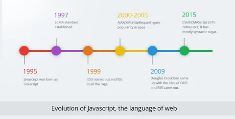

# Презентация по JavaScript

## Что такое Java script

JavaScript — это **динамический** язык программирования, который используется для создания интерактивных элементов на веб-страницах. Он позволяет:
- Реагировать на действия пользователя.
- Изменять HTML и CSS на странице.
- Выполнять сложные операции без перезагрузки страницы.

## История JavaScript



JavaScript был создан Брэнданом Айком в 1995 году. Изначально язык назывался Mocha, затем был переименован в LiveScript, и только потом стал известен как JavaScript. 

### Ключевые моменты в истории JavaScript:
- **1995:** Создание языка Mocha (позже переименованного в JavaScript) Брэнданом Айком из Netscape.
- **1996:** JavaScript официально выпущен в виде версии 1.0 в Netscape Navigator.
- **1997:** ECMAScript, стандарт для JavaScript, был принят организацией ECMA International.
- **1999:** Выпуск ECMAScript 3 с новыми функциями, такими как регулярные выражения и обработка исключений.
- **2005:** Появление AJAX, что позволило создавать более интерактивные веб-приложения.
- **2009:** Выпуск ECMAScript 5 с улучшениями в области работы с объектами и функций.
- **2015:** Выпуск ECMAScript 6 (ES6) с большим количеством новых функций, таких как стрелочные функции, классы и модули.

## Операторы и типы данных в JavaScript
### Типы данных в JavaScript

JavaScript поддерживает несколько основных типов данных:


- **Примитивные типы:**
 ** `string` **: строки текста.
   ```javascript
    let name = "Alice";
    ```
  - **`number`**: числа, включая целые и дробные.
    ```javascript
    let age = 25;
    ```
  - **`boolean`**: логические значения `true` или `false`.
    ```javascript
    let isStudent = true;
    ```
  - **`undefined`**: переменная, которой не было присвоено значение.
    ```javascript
    let score;
    ```
  - **`null`**: отсутствие значения.
    ```javascript
    let user = null;
    ```
  - **`symbol`**: уникальные идентификаторы.
    ```javascript
    let sym = Symbol('description');
    ```
  - **`bigint`**: целые числа произвольной длины.
    ```javascript
    let bigNum = 1234567890123456789012345678901234567890n;
    ```

- **Объекты:**
  - **`object`**: коллекция пар "ключ-значение".
    ```javascript
    let person = {
        name: "Alice",
        age: 25
    };
    ```

### Операторы в JavaScript

JavaScript поддерживает несколько видов операторов:

- **Арифметические операторы:**
  - `+`: сложение
  - `-`: вычитание
  - `*`: умножение
  - `/`: деление
  - `%`: остаток от деления
  ```javascript
  let sum = 10 + 5;  // 15